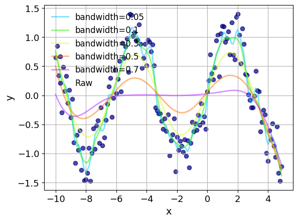
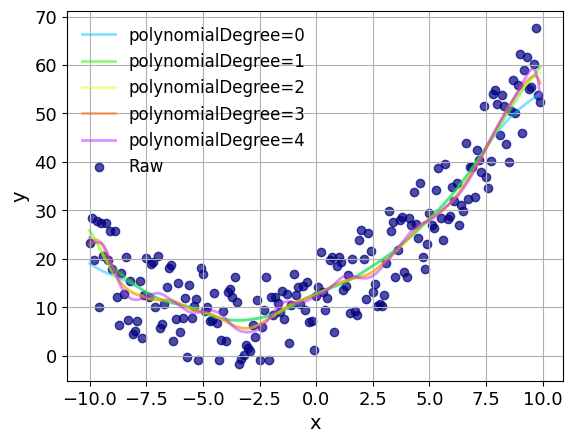

# Examples of LOWESS Smoothing
This directory contains examples of use of the `lowess` package.
The examples require the `matplotlib` and `numpy` packages.
Each script should produce a `png` file containing a plot of its results.

## Smoothing with different Bandwidths
The script `lowess_by_bandwidth.py` smooths a noisy sine signal using LOWESS varing the bandwidth used to select the set of local points for the regression.

The smaller bandwidths will fit noise.
The larger bandwidths will miss the oscillating signal.

## Smoothing with different Polynomial Degrees
The script `lowess_by_polynomialDegree.py` smooths a noisy quadratic signal using lowess.lowess, varing the degree of the polynomial used in the regression.

The 0th and 1st order polynomials will miss the large scale curvature towards the ends of the interval.
The higher order polynomials will over fit, and have high frequency oscillations.

